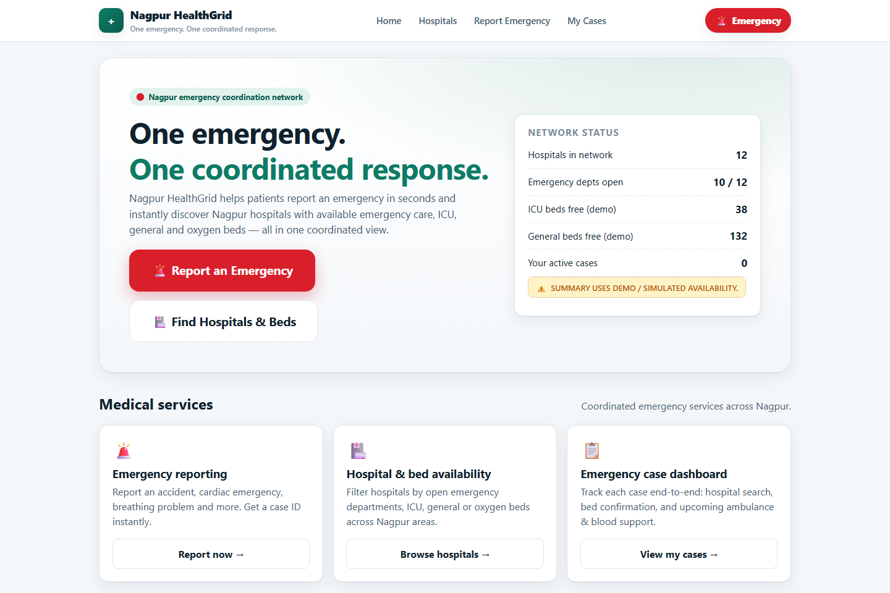
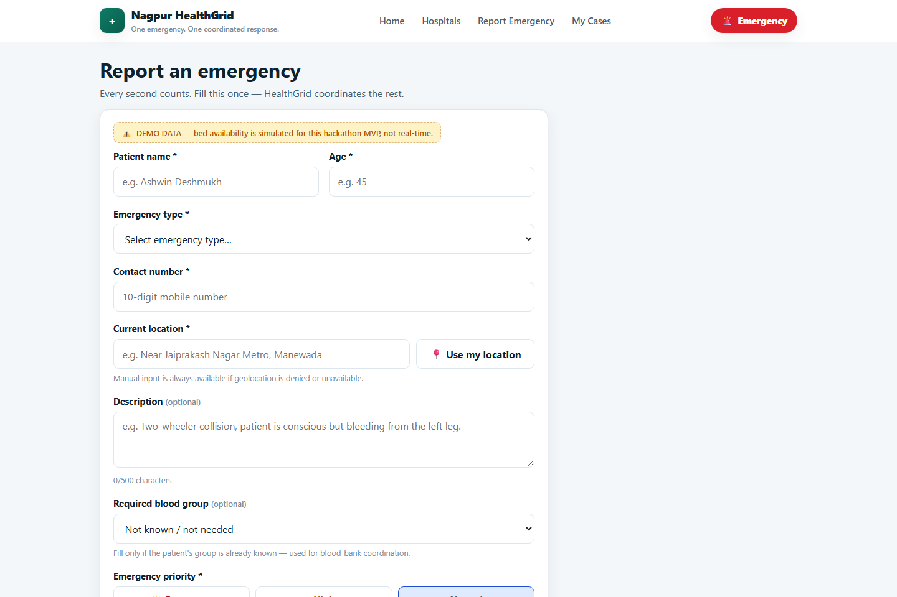
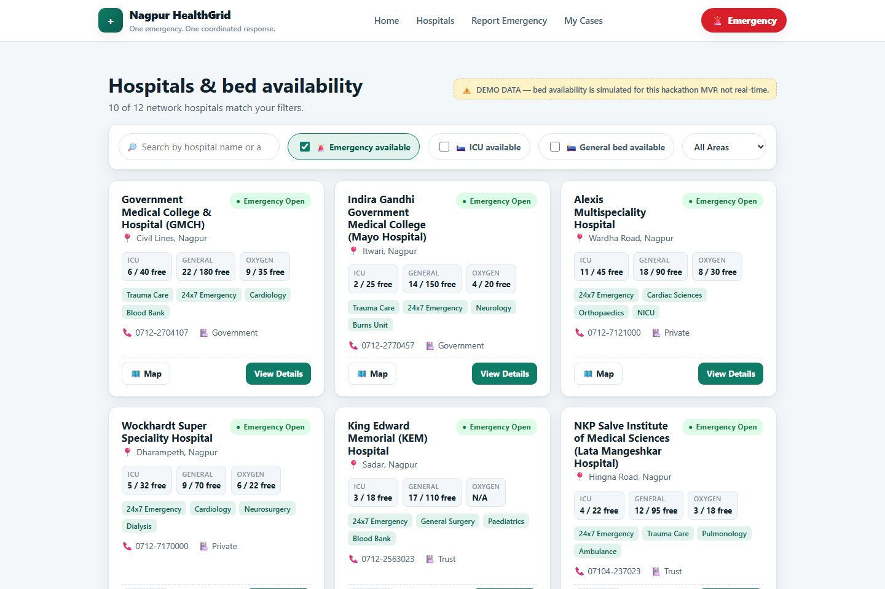
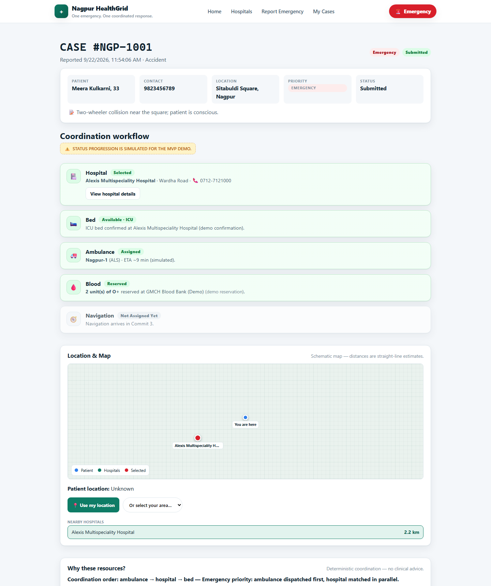
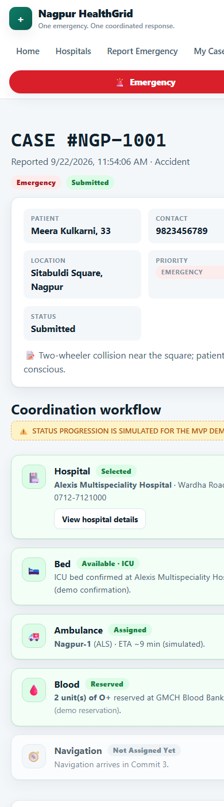
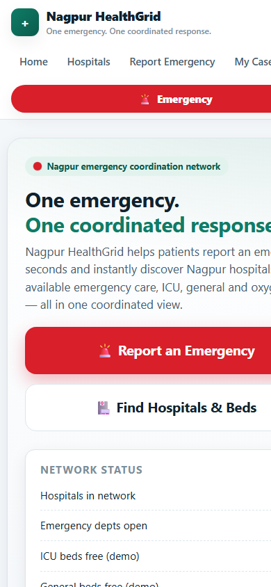

# Nagpur HealthGrid 🚨🏥

> **One emergency. One coordinated response.**

Nagpur HealthGrid is an emergency healthcare coordination platform that organizes ambulance,
hospital, resource, blood-bank and navigation workflows around a single emergency case.

## The problem

In an emergency, patients and families bounce between disconnected tools: one app to find a
hospital, another for an ambulance, phone calls for blood banks — with no shared state between
any of them. Hospital finders list facilities; none of them **run the emergency response**. In
the critical first minutes, information exists but coordination doesn't.

## The solution: Emergency Case Orchestration

Nagpur HealthGrid is **not a hospital finder, ambulance finder, or blood-bank finder**. It is an
**Emergency Case Orchestrator**: every report creates a single case (`NGP-1001`, `NGP-1002`, …)
that becomes the backbone for the entire response. Each workflow step — hospital matching, bed
confirmation, ambulance dispatch, blood reservation — reads from and writes to that one case, so
the whole response stays in sync on one dashboard.

**What makes it different from a finder app:**

| Finder apps | Nagpur HealthGrid |
| --- | --- |
| List hospitals/ambulances/blood banks | Coordinates all of them around one case |
| You do the calling and tracking | The case tracks every step's status automatically |
| Static directory data | Explainable allocation: *why* each resource was chosen |
| No memory between steps | Every step persists against the same case ID |

## Core workflow

```
Emergency Request → Coordination → Ambulance → Hospital/Resource → Blood/Services → Navigation
      ✅ live          ✅ live        ✅ live         ✅ live             ✅ live         🔜 Commit 3
```

Priority drives the **coordination order only** (never clinical urgency): Emergency/High cases
dispatch the ambulance first, Normal cases secure a hospital bed first. Every allocation shows
its reasoning on the dashboard ("Why these resources?") — deterministic, explainable, and
explicitly **not** clinical advice.

## ⚠️ Demo data disclaimer

All hospital, ambulance and blood-bank data is **DEMO / SIMULATED**. There is **no real-time bed
data, no live ambulance GPS, and no government or hospital-network integration** — those require
verified APIs and are roadmap items, not features. Nothing here must be used for real medical
decisions. For real emergencies in India call **112** / **108**.

## Implemented features

- **Emergency request intake** — validated form (patient name, age, emergency type, 10-digit
  contact, location, optional description & blood group, priority) generating a unique case ID
  (`NGP-1001`, `NGP-1002`, …) with a confirmation page.
- **Hospital discovery** — 12 demo Nagpur hospitals with emergency availability, ICU / general /
  oxygen beds, contact, distance, and detail pages. Filter by emergency/ICU/general-bed/area plus
  name-area search.
- **Ambulance coordination** — 10-unit demo Nagpur fleet (ALS / BLS / PTV) with Available,
  Assigned, Busy and Offline states; deterministic dispatch matching (availability, ALS-for-
  Emergency, proximity) with simulated ETA, persisted against the case.
- **Blood-bank availability** — 8 demo Nagpur blood banks covering all 8 blood groups; search by
  group, unit count and distance; deterministic selection with a simulated reservation on the case.
- **Emergency resource allocation** — deterministic, explainable coordination combining priority,
  type, location and resource availability into a plan whose reasons render on the dashboard.
- **Emergency case dashboard** — live workflow steps (Hospital → Bed → Ambulance → Blood →
  Navigation) with status transitions, an allocation-explanation panel, and a location panel
  (schematic map, browser geolocation with manual-area fallback, straight-line distances,
  Google Maps deep links).
- **Persistence** — cases and fleet state survive reloads via localStorage; every service is
  swap-ready for real APIs later.
- **72 automated tests** (Vitest + Testing Library) covering services, matching, persistence and
  the dashboard workflow.

## Demo

### Screenshots

All screenshots were captured from the running app with **simulated demo data** — the case shown
(NGP-1001) is a seeded example, not a live emergency.

| | |
| --- | --- |
|  |  |
| *Landing — one emergency, one coordinated response.* | *Emergency request form with priority & blood group.* |
|  |  |
| *Hospital discovery — filters, beds, distance.* | *Case dashboard — Hospital → Bed → Ambulance → Blood orchestrated.* |
|  |  |
| *Mobile case dashboard (390px).* | *Mobile landing (390px).* |

### Run it yourself

```bash
npm install && npm run dev   # → http://localhost:5173
```

Suggested walkthrough: report an emergency (try priority **Emergency** with blood group **O+**)
→ watch the case dashboard progress Hospital → Bed → Ambulance → Blood → revisit **My Cases**.

## Tech stack

- [Vite](https://vitejs.dev/) + [React 18](https://react.dev/) + [TypeScript](https://www.typescriptlang.org/) (strict)
- [React Router 6](https://reactrouter.com/)
- Plain CSS design system (no UI framework), mobile-first responsive
- [Vitest](https://vitest.dev/) + [Testing Library](https://testing-library.com/) (unit + integration)

## Getting started

```bash
npm install
npm run dev        # http://localhost:5173
```

| Script | Purpose |
| --- | --- |
| `npm run dev` | Start the dev server |
| `npm run build` | Production build |
| `npm run preview` | Preview the production build |
| `npm run typecheck` | Strict TypeScript check |
| `npm test` | Run all unit/integration tests once |
| `npm run test:watch` | Watch mode |

## Project structure

```
src/
├── components/     # Reusable UI (Header, HospitalCard, LocationPanel, AllocationPanel, ui primitives)
├── constants/      # Emergency types, priorities, Nagpur areas, map helpers
├── data/           # DEMO datasets: hospitals, ambulances, blood banks (swap with real feeds later)
├── models/         # Domain types — the contract between UI and services
├── pages/          # Route pages (home, form, confirmation, hospitals, detail, cases, dashboard)
├── services/       # emergency, hospital, location, ambulance, bloodBank, resourceAllocation (+ tests)
├── styles.css      # Design system
└── test/           # Vitest setup
```

**Architecture note:** the layering is deliberately simple — UI components render from typed
models and call services; services own all business logic and are the only place demo datasets
are imported, so each one can be swapped for a real API without touching the UI. (No architecture
diagram yet — intentionally, until the system earns one.)

## Roadmap

- **Commit 3:** AI emergency assistant, smart coordination, real-time communication, navigation,
  and the final polished dashboard.

## Team

- **Rodrix Dcruz**
- **Rina Neware**
- **Bhushan Lede**
- **Sujal Khobragade**

---

For real emergencies in India, call **112** / **108**. This is a hackathon prototype with
simulated data.
